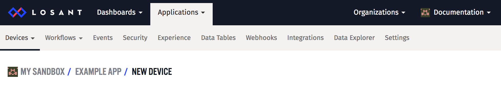

# Lost Documentation Notes

## Page Meta Info

There are a few tags you can use at the **top of a file** and they will be transformed into `meta` tags. See the [doc generation logic](https://github.com/Losant/losant-docs/blob/release/losant/main-no-disqus.html#L14)

### Description

- Pragma: `description:`
- Under 150 chars
- Should have a call to action: “learn more”, “read more”
- All pages need one

```markdown
description: Learn more about how to write descriptions

# Some Header
Text about the thing ... 
```

### Flow Class

- Pragma: `flowclass:`
- `Cloud` or `Edge 1.0.0` (whatever version)
- "triggers" and "nodes"

```markdown
flowclass: Edge 1.0.0
description: Learn more about how to write descriptions

# Some Header
Text about the thing ... 
```

## Screenshots / Images
- `1200px` wide
- PNG
- run them through `imageoptim` **before** committing
- Boxes around selection areas should be red with a border of `5px`

Make sure you change your name to `Documentation` and your avatar to be generic, like so:



## Relative Links
Relative links to docs pages should use a trailing `/` . Failing to do so will send the user on a silly redirect.

Instead of 
```markdown
Something [is a link](/devices/edge-compute) to a place
```

it should be 
```markdown
Something [is a link](/devices/edge-compute/) to a place
```
