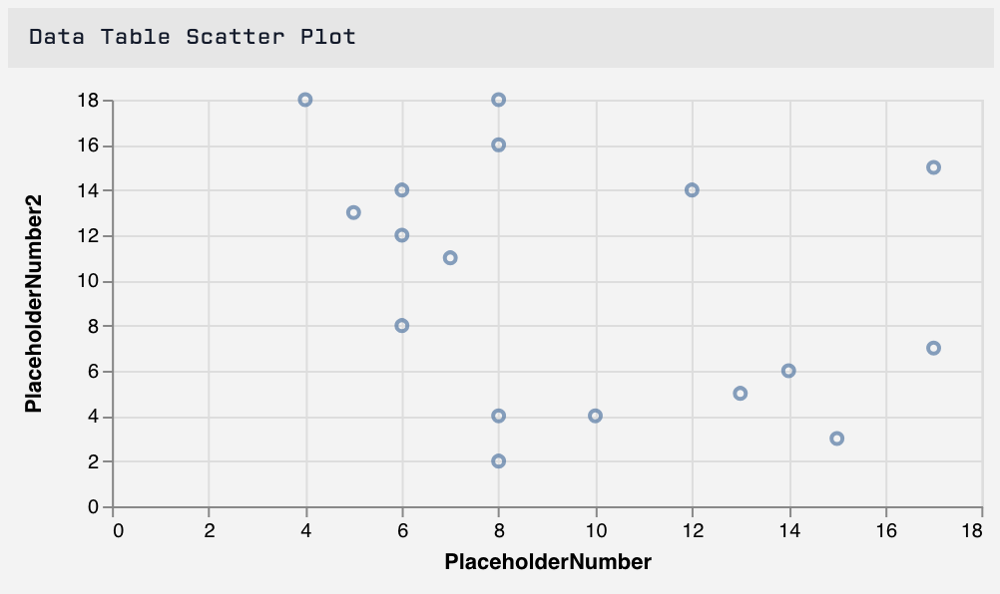
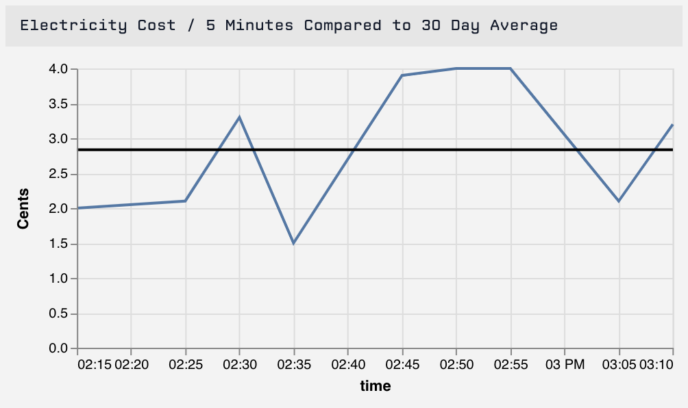

# Custom Chart

The Custom Chartm Block is an advanced Block that allows you to create custom data visualization by utilizing [Vega-Lite](https://vega.github.io/vega-lite/). If you would like a specific visualization that's not already a Losant Dashboard Block, the Custom Chart Block gives you the ultimate support for a wide array of visualization types.



## Configuration

Configuring the Custom Chart Block is broken up into three sections ...

### Choosing an Application

First, choose an application that owns the devices and/or the data tables you would like to query.


### Datasets


#### Time Series Datasets

Time series datasets provide the value of a single attribute from a selected device over a duration of time at a selected resolution. The values returned from the query will be returned as an array of objects in the form of `{ time: <time>, value: <value> }`. The value returned will reflect the selected attribute's value specified at a specific time.


#### Guage Datasets

Guage datasets allow you to query a single attribute from a selected device and will return an object in the same form as an individual object from a time series dataset. You can select a duration which will pull all available data that was recorded in the selected duration. If you are pulling any data that is not just the last reported data point, you will need to select an aggregation to perform on the data.


#### Data Table Datasets

Data table datasets allow you to query any data that is stored on a data table. The data table query will return an array of your data table rows where the column names will be the keys you will reference. We will automatically generate a list of columns that are available to query as well as all default row data. You can customize the result by using a custom query. If you want to return all rows, simply don't include a custom query.


Data table datasets have access to multiple query modes. With these query modes you can choose "Match any of the following..." which will select any row that matches at least one of the queries, "Match all of the following..." which will select any row that matches all of your queries, or ["Advanced"](../data-tables/overview/#advanced-queries) query mode.


### Vega Configuration

Once you have a dataset, you can write a custom vega configuration. We will provide a default configuration that includes the Vega-Lite schema and will be sized to the Dashboard Block size. The default configuration will not be valid as you will have to provide the data.


When referencing a dataset, you will need to do so as a [named data source](https://vega.github.io/vega-lite/docs/data.html#named) based on the what is entered in the 'Query Name' field. All datasets will be formatted as JSON data so you will not need to set a data format in your configuration. Keep in mind that you can use any valid [Vega-Lite data source](https://vega.github.io/vega-lite/docs/data.html#types-of-data-sources) to populate your chart, not just any of your previously created datasets.

For more information on configuring Vega-Lite, please reference the [Vega-Lite documentation](https://vega.github.io/vega-lite/docs/).

### Examples

#### Time Series Bar Chart


```json
{
  "width": {{block.width}},
  "height": {{block.height}},
  "autosize": {
    "type": "fit",
    "contains": "padding"
  },
  "description": "A simple time series bar chart.",
  "data": {
    "name": "time-series-0"
  },
  "mark": "bar",
  "encoding": {
    "x": {
      "field": "time",
      "type": "temporal",
      "timeUnit": "minutes"
    },
    "y": {
      "field": "value",
      "type": "quantitative",
      "axis": {"title": "Cents"}
    }
  }
}
```

#### Layered Time Series Line Chart with Gauge as Average Line



```json
{
  "width": {{block.width}},
  "height": {{block.height}},
  "autosize": {
    "type": "fit",
    "contains": "padding"
  },
  "layer": [
    {
      "data": {
        "name": "time-series-0"
      },
      "mark": "line",
      "encoding": {
        "x": {
          "field": "time",
          "type": "temporal"
        },
        "y": {
          "field": "value",
          "type": "quantitative",
          "axis": {
            "title": "Cents"
          }
        }
      }
    },
    {
      "data": {
        "name": "gauge-0"
      },
      "mark": "rule",
      "encoding": {
        "y": {
          "field": "value",
          "type": "quantitative"
        },
        "size": {"value": 2}
      }
    }
  ]
}
```

#### Data Table Scatter Plot


```json
{
  "width": {{block.width}},
  "height": {{block.height}},
  "autosize": {
    "type": "fit",
    "contains": "padding"
  },
    "description": "A simple time series bar chart.",
  "data": {
      "name": "data-table-0"
  },
  "mark": "point",
  "encoding": {
    "x": {
      "field": "PlaceholderNumber",
      "type": "quantitative"
    },
    "y": {
      "field": "PlaceholderNumber2",
      "type": "quantitative"
    }
  }
}
```